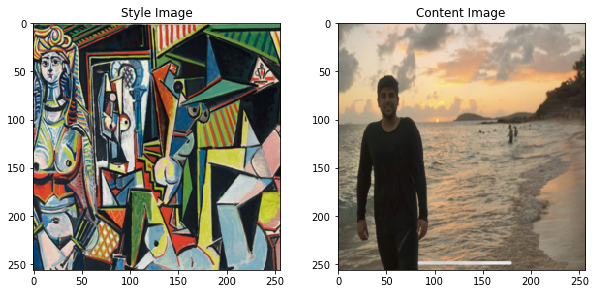

# Neural Style Transfer

Nueral Style Transfer using PyTorch. Original paper by *Leon A. Gatys*, *Alexander S. Ecker* and *Matthias Bethge* [here](https://arxiv.org/abs/1508.06576). Majority of the code used for this repository is authored by *Alexis Jacq* and edited by *Winston Herring*. The link for their article can be found [here](https://pytorch.org/tutorials/advanced/neural_style_tutorial.html).

## What we are trying to accomplish

To keep it simple, **Neural Transfer** involves reproducing the contents of an *input image* with the artistic style of a *style image*. For example, can we take the *style* of the watercolor painting below and the *content* of the turtle image in order to produce a third image which is a 'combination' of the two. As you can see, this can lead to very fun results!

**Source:** Pytorch Advanced Tutorials

### Basic Theory

Two distances, one for the content (DC) and one for the style (DS) are defined. They measure how different two images are content-wise and stylistically.

A third image, called the input image, which can be white noise or the content image itself is then transformed so that its content-distance with the content-image and its style-distance with the style-image are both minimized.

#### Style and Content Images

