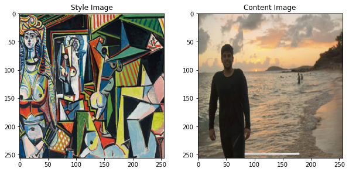
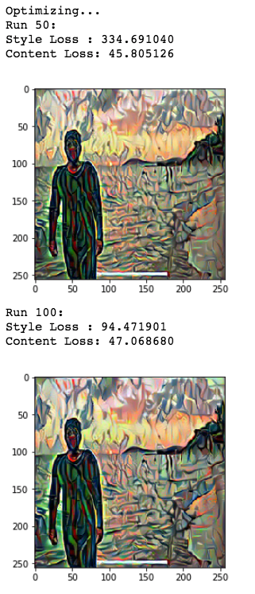
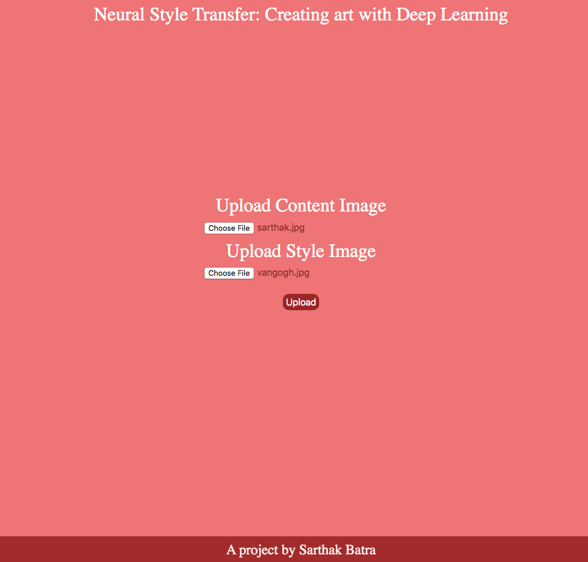
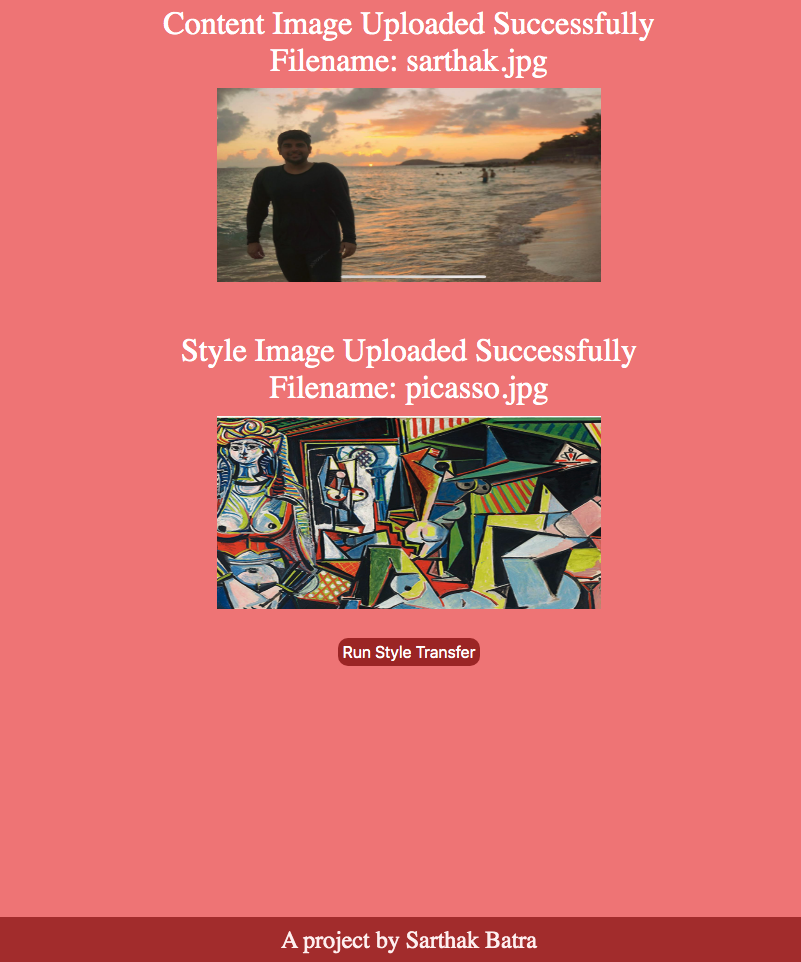

# Neural Style Transfer

Nueral Style Transfer using PyTorch. Original paper by *Leon A. Gatys*, *Alexander S. Ecker* and *Matthias Bethge* [here](https://arxiv.org/abs/1508.06576). Majority of the code used for the style transfer process is authored by *Alexis Jacq* and edited by *Winston Herring*. The link for their article can be found [here](https://pytorch.org/tutorials/advanced/neural_style_tutorial.html). Few modifications have been made to enhance the results.

## What are we trying to accomplish?

To keep it simple, **Neural Transfer** involves reproducing the contents of an *input image* with the artistic style of a *style image*. For example, can we take the *style* of the watercolor painting below and the *content* of the turtle image in order to produce a third image which is a 'combination' of the two. As you can see, this can lead to very fun results!

**Source:** Pytorch Advanced Tutorials


### Basic Theory

Two distances, one for the content (D<sub>C</sub>) and one for the style (D<sub>S</sub>) are defined. They measure how different two images are content-wise and stylistically.

A third image, called the input image, which can be white noise or the content image itself is then transformed so that its content-distance with the content-image and its style-distance with the style-image are both minimized.

### Style and Content Images



### Output Images



## The Jupyter Notebook

The [style_transfer notebook](https://github.com/sarthakbatragatech/style_transfer/blob/master/style_transfer.ipynb) in this repository is a step by step guide to achieve style transfer. As pointed out in the first section, majority of it has been authored and edited by [Alexis Jacq](https://alexis-jacq.github.io/) and [Winston Herring](https://github.com/winston6). I have simplified and added onto their original comments so that someone with very little experience can grasp this beautiful concept. I have also modified the code so that it produces an output image every few epochs as opposed to just the one at the end of the cycle. This is because I noticed that quite often it was the image produced in one of the intermediate steps that was more appealing.

## Flask based Web Application

To make the style transfer process practical and scalable, I made a [Flask](https://www.palletsprojects.com/p/flask/) based Web Application that allows you to upload a content image and a style image of your choice. The network runs seamlessly on these two images and renders the desired output image in the browser. You can quickly experiment with different styles and generate several cool images!

### App Screenshots

 

### How do I run the Web App?

After cloning the repository from Github, make sure you are in the project directory and execute the following commands:

```python3
# Create a virtual environment
python3 -m venv env
# Activate the virtual environment (For Windows: env\Scripts\activate.bat)
source env/bin/activate
# Install the project dependencies
pip install -r requirements.txt
# Run the App
python3 run.py
```

Be sure to mess around with network parameters and try the various styles I have shared in the [data](https://github.com/sarthakbatragatech/style_transfer/tree/master/data) folder.

### What's Next for this Project?

- Allow the user to control parameters of the network like style weight and content weight, number of iterations, image size, etc. through the web app.
- Improve structure of the codebase, create subdirectors to better organize stuff
- Push image storage, retrieval and running the network to the cloud and make a modern web-app that can be shared easily with anyone, on any device.
- Detail some interesting issues that I ran into while working on this project including browser caching, dealing with extra image channels, etc.
